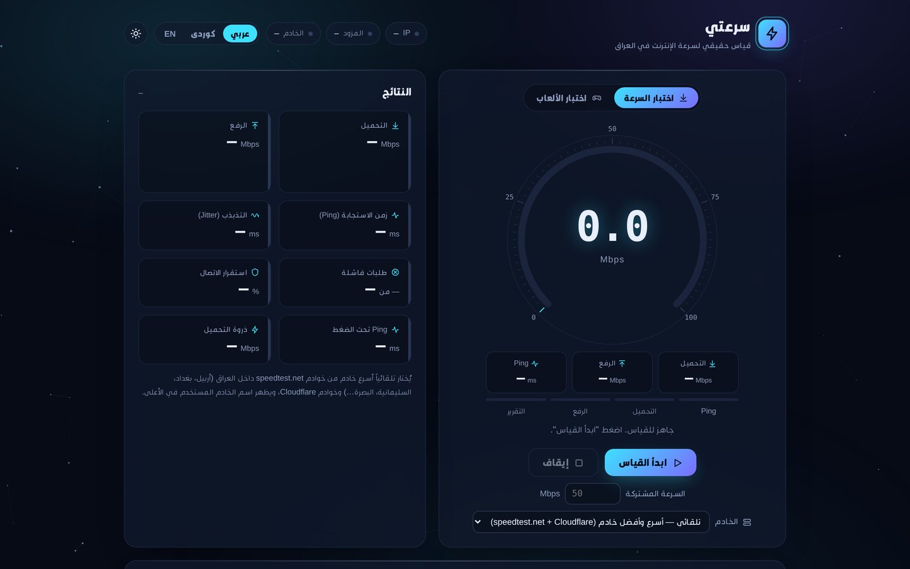
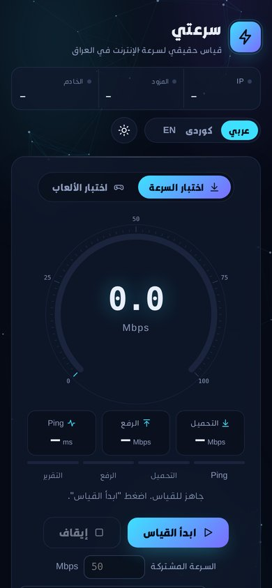

# Sur3ati (سرعتي) · iqspeed.net

Internet speed test built for Iraq.

**Live:** https://iqspeed.net

## Why I made it

Most speed tests people in Iraq use end up on servers far away, so the numbers rarely match what you actually get at home. I wanted something that tests against servers inside the country, gives a stable reading, and tells you in plain words what's wrong when the connection is bad.

## What it does

- Picks the fastest test server inside Iraq on its own (Erbil, Baghdad, Sulaymaniyah, Basra and others), with Cloudflare as a fallback
- Measures download, upload, ping, jitter, packet loss and ping under load (bufferbloat)
- Shows a short diagnostic report after each test: what the problem is and what to try
- Gaming latency test to regional game servers, drawn on a map of Iraq
- Arabic, Kurdish (Sorani) and English, light and dark theme
- Keeps a local history of your tests
- Works as a PWA, plus native Android and iPhone apps

## How it's built

- `index.html` – the whole web app in one file (vanilla JS, canvas gauge, no framework)
- `android/` – Android app (WebView wrapper, Java). CI builds a signed APK and publishes it to the site
- `ios/` – iPhone app (SwiftUI + WKWebView, XcodeGen). CI builds and runs it in the simulator
- `social/` – motion video, brand kit and social assets, rendered from HTML
- Hosted on GitHub Pages, domain on GoDaddy

## Author

Designed and developed by **Mohammed Ismael (Raizo)**, Erbil.
I own the project and do all the work on it: measurement engine, design, apps, hosting and branding.

Contact: hello@iqspeed.net

---

© 2026 Mohammed Ismael. All rights reserved.
